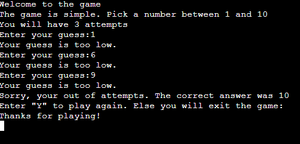

# Number Guessing Game

This programme is a number guessing game created within python. It runs within a provided, interactive console. It is designed to show how to handle integer inputs can be handled and checked wihtin python. A live version of the site can be found [here](https://sean-number-guess-d51024dc4294.herokuapp.com/)

### How it works

The app will ask the user to input a number between 1-10. The programme will check to see if the number is the same as the correct answer it has generated. The user will have 3 attempts to guess corectly otherwise the game will end.

### Testing

One particular problem I had was dealing with non-integer inputs. I was able to fix this by wrapping the code in a try statement and handling the value error within the except statement

The programme was also tested in the following ways:
- Passing it throught a PEP8 linter and passing without any major issues
- Giving invalid inputs and ensuring the errors are picked up
- Tested both in a python terminal and on Heroku

### Depoloyment

- Steps for deployment
    - Create a Heroku app
    - Setup a config var called PORT and set to 8000
    - Link the Heroku app to my GitHub repository
    - Deploy the app [here](https://sean-number-guess-d51024dc4294.herokuapp.com/)